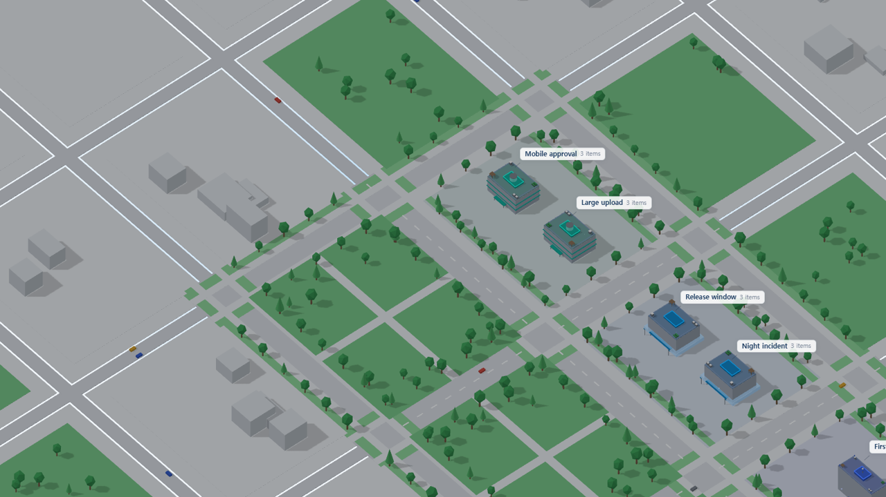
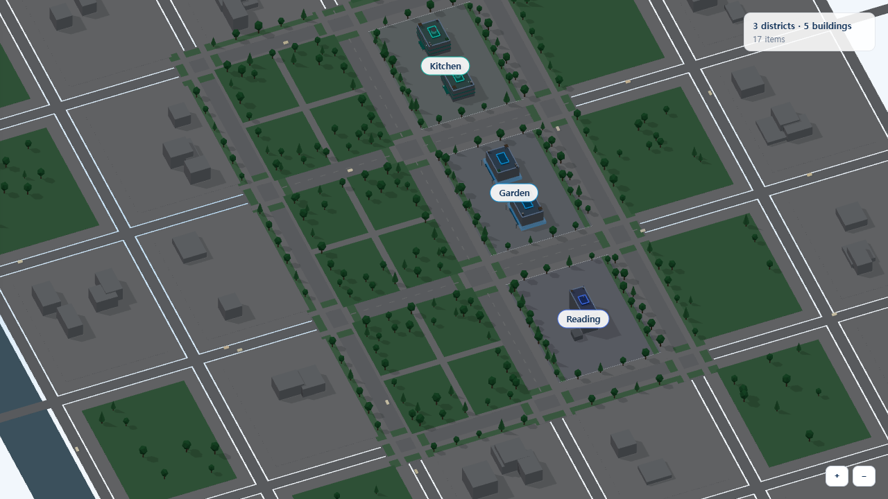

<p align="center">한국어 | <a href="README.en.md">English</a></p>

<p align="center">
  
</p>

<p align="center">
  
  
  
  
  
</p>

**글을 붙여 넣으면 도시가 됩니다.** `#` 제목은 구역, `##` 제목은 건물, 그 아래 줄은 항목이 됩니다. 건물은 항목이 많을수록 높아지고, 창은 활성도만큼 불이 켜지며, 아직 쓰지 않은 자리는 빈 필지로 남습니다. 아는 것의 모양과 비어 있는 곳이 눈에 보입니다. three.js 기반이며 모든 처리는 브라우저 안에서 끝납니다.



## 주요 기능

- **텍스트 → 도시**: Markdown, 평문, CSV, TSV, JSON 을 구역 > 건물 > 항목 3계층으로 읽습니다. 어떤 규칙으로 읽었는지는 결과의 `notes` 로 알려 줍니다.
- **시각 인코딩**: 높이는 항목 수, 창 불빛은 활성도(0~1), 색은 구역, 건물 사이 도로는 직접 지정한 `links`, 빈 필지는 `gaps` 로 적어 둔 공백입니다.
- **항목 수 → 층수**: 10건까지는 1건 = 1층, 이후 완만하게 늘다가 26층에서 멈춥니다. 건물 하나가 도시 전체를 가리지 않습니다.
- **조작**: 끌어서 이동, Shift·우클릭 끌기로 회전, 휠·핀치로 확대, 건물 클릭 시 각도를 유지한 채 확대, 가만히 두면 천천히 회전.
- **낮/밤**, 팔레트 교체, 활성도 기준 이하 건물 소등, 건물 강조.
- **건물 양식 5종**: `lab`, `lobby`, `control`, `server`, `campus`.
- **연출**: 건물이 올라오는 동안 공사 장비, 도로 위 차량, 떠다니는 입자, 외곽 블록. 옵션으로 끌 수 있습니다.
- **렌더링 전용**: 정사영 카메라, 인스턴스 메시(차량·입자 등), 창 조명은 캔버스 텍스처 4단계를 모든 건물이 공유합니다. 상태 관리, 서버, 프레임워크 바인딩은 없습니다.



## 빠른 시작

요구 사항: Node.js 18 이상.

```bash
git clone https://github.com/junghun133/voxel-skyline
cd voxel-skyline
npm install
npm run dev          # http://localhost:5173 (examples/basic 데모)
```

| 스크립트 | 설명 |
| --- | --- |
| `npm run dev` | `examples/basic` 데모를 Vite 개발 서버(포트 5173)로 실행 |
| `npm run build` | 라이브러리를 `dist` 로 빌드 (ES 모듈, 타입 선언, `style.css` 포함) |
| `npm run typecheck` | `tsc --noEmit` 타입 검사 |
| `npm run format` / `format:check` | Prettier 적용 / 검사 |

### 데모 사용 순서

1. 열면 예시 글이 이미 올라가 있습니다. 건물이 올라오는 동안 크레인과 트럭이 보이고, 끝나면 사라집니다.
2. 왼쪽 칸의 글을 `#`, `##` 이 있는 아무 글로 바꾸고 **Build city** 를 누르면 도시가 다시 섭니다. **Sample** 은 예시 글로 되돌립니다.
3. 건물을 클릭하면 확대되고 오른쪽에 항목이 나옵니다.
4. **Night** 로 밤 모드, **Home** 으로 처음 시점으로 돌아갑니다.
5. `.md`, `.txt`, `.csv`, `.json` 파일을 드롭 영역에 떨어뜨리면 읽습니다. 어떤 규칙을 썼는지는 드롭 영역 아래에 나옵니다.

## 입력 형식

`ingestText(text, name?)`, `ingestTexts([{ name, text }])`, `ingestFiles(fileList)` 는 `CityData` 와 `notes` 배열을 돌려줍니다.

| 입력 | 읽는 방식 |
| --- | --- |
| Markdown, 평문 | `#` 는 구역, `##` 이하는 건물, 목록 항목과 문단은 항목 |
| 제목 없는 텍스트 | 파일 이름이 구역, 빈 줄로 나뉜 덩어리가 건물 |
| CSV, TSV | 헤더에서 district / building / item / activity 열을 찾고, 헤더가 없으면 1·2·3열 |
| JSON | `districts` 와 `buildings` 배열이 있으면 `CityData` 로 그대로 사용, 행 배열이면 표처럼 읽음 |

- CSV 헤더는 `district`, `group`, `구역`, `분야`, `category` / `building`, `topic`, `건물`, `주제` / `item`, `title`, `항목`, `제목`, `name` / `activity`, `weight`, `활성` 이 들어간 이름을 인식합니다.
- `ingestFiles` 는 브라우저 File API 로 읽고 8MB 를 넘는 파일은 건너뜁니다. 서버로 올리지 않습니다.

```csv
district,building,item,activity
Product,Mobile approval,Went responsive instead of a native app,0.9
Product,Large upload,Split files into 5MB chunks,0.2
```

## 라이브러리 API

> 아직 npm 에 배포되지 않았습니다. 사용하려면 저장소를 클론해 `npm run build` 로 `dist` 를 만드세요. `three` 는 peer dependency(`>=0.160`)입니다.

```ts
import { createCityRenderer, ingestText } from 'voxel-skyline';
import 'voxel-skyline/style.css';

const city = createCityRenderer(document.getElementById('app')!, {
  formatCount: (n) => `${n} items`,
});
city.start();

city.setData(
  ingestText(`
# Product
## Mobile approval
- Went responsive instead of a native app
- App review blocks same-day fixes

# Operations
## Release window
- Tuesday and Thursday afternoon only
`),
);

city.on('select', (building) => {
  if (building) console.log(building.name, building.count);
});
```

### 구조화된 데이터 직접 입력

```ts
city.setData({
  districts: [{ id: 'ops', label: 'Operations', gaps: ['Runbooks'] }],
  buildings: [{ id: 'release', name: 'Release window', districtId: 'ops', count: 12 }],
  items: [{ id: '1', title: 'Tuesday only', buildingId: 'release', activity: 0.9 }],
  links: [{ a: 'release', b: 'oncall' }],
});
```

- `count`: 높이를 정합니다. 없으면 `items` 개수를 셉니다.
- `activity` (0~1): 창 불빛 밝기. 건물에 없으면 항목들의 평균입니다.
- `gaps`: 이름이 붙은 빈 필지.
- `links`: 건물 사이 도로. `weight` 로 굵기를 줍니다.
- 구역은 `hue`, `blockIndex`(3×2 격자의 0~5칸), `style`, `description` 을 줄 수 있습니다.

### `createCityRenderer(container, options)` 가 돌려주는 객체

| 메서드 | 설명 |
| --- | --- |
| `setData(data)` | 도시를 다시 세움 |
| `getLayout()` | 좌표·크기까지 계산된 현재 배치 |
| `focusBuilding(id, zoom?)` | 보던 각도를 유지한 채 건물로 확대 |
| `focusDistrict(id)` | 구역 하나가 보이게 이동 |
| `home()` | 처음 시점으로 |
| `zoomBy(factor)` / `setZoom(z)` | 확대·축소 |
| `setNight(on)` | 밤 팔레트 |
| `setHighlight(ids \| null)` | 일부 건물만 강조, 나머지는 옅게 |
| `setActivityThreshold(t)` | 활성도가 `t` 보다 낮은 건물 소등 |
| `setPalette(input)` | 색 다시 계산 (테마 전환) |
| `setAutoRotate(on)` | 자동 회전 |
| `resize()` / `start()` / `stop()` / `dispose()` | 수명 주기 |
| `on('hover' \| 'select' \| 'view', fn)` | 이벤트. 구독 해제 함수를 반환 |
| `canvas` | three.js 가 만든 캔버스 (읽기 전용) |

옵션: `palette`, `night`, `outskirts`, `traffic`, `ambient`, `construction`, `riseSeconds`(기본 2.6), `autoRotate`, `labels`, `formatCount`, `insets`.

### 스타일

`voxel-skyline/style.css` 는 캔버스 위에 뜨는 라벨(`.vs-building`, `.vs-district`, `.vs-gap`, `.vs-leaders line`)을 꾸밉니다. 색은 팔레트에서 오며, `readPalette(el, '--vs-')` 로 CSS 변수에서 읽을 수도 있습니다.

## 기술 스택

| 영역 | 사용 |
| --- | --- |
| 렌더링 | three.js (정사영 카메라, 인스턴스 메시, 캔버스 텍스처) |
| 언어 | TypeScript 5 |
| 빌드 | Vite 5 (라이브러리 모드, ES 모듈), vite-plugin-dts |
| 포맷 | Prettier |

## 프로젝트 구조

```text
src/
  index.ts        공개 API
  renderer.ts     createCityRenderer, 조작·라벨·이벤트
  ingest.ts       텍스트·파일 → CityData
  layout.ts       구역 격자 배치, 층수·형태 계산
  buildings.ts    건물 양식, 창 조명 텍스처
  scene.ts  camera.ts  palette.ts  constants.ts  types.ts
  construction.ts  traffic.ts  ambient.ts  outskirts.ts
  style.css       라벨 스타일
examples/basic/   Vite 데모 (npm run dev)
docs/             스크린샷
assets/           README 배너
scripts/          빌드 보조 (CSS 복사)
```

## 기여

이슈와 PR 을 환영합니다. 자세한 규칙은 [CONTRIBUTING.md](CONTRIBUTING.md) 를 보세요. 변경 이력은 [CHANGELOG.md](CHANGELOG.md) 에 있습니다. 코드 주석은 한국어를 기준으로 합니다.

## 라이선스

[MIT](LICENSE) © 2026 Junghun Park
